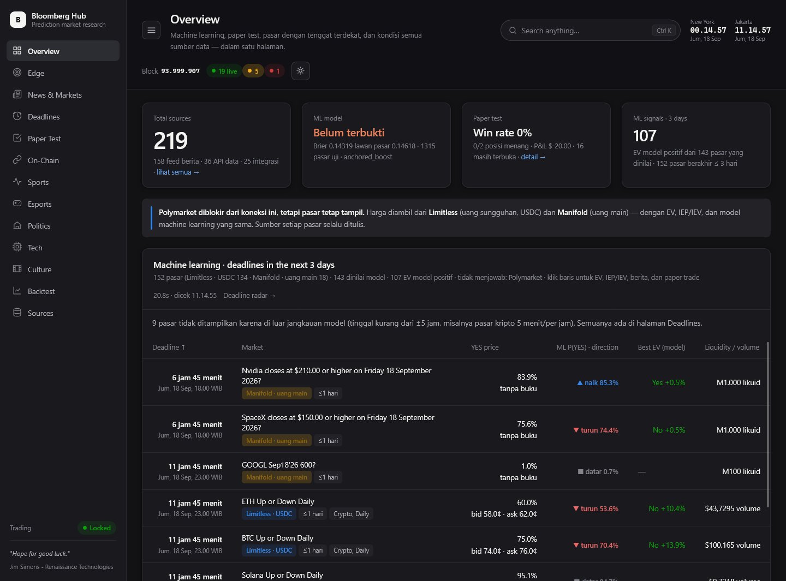
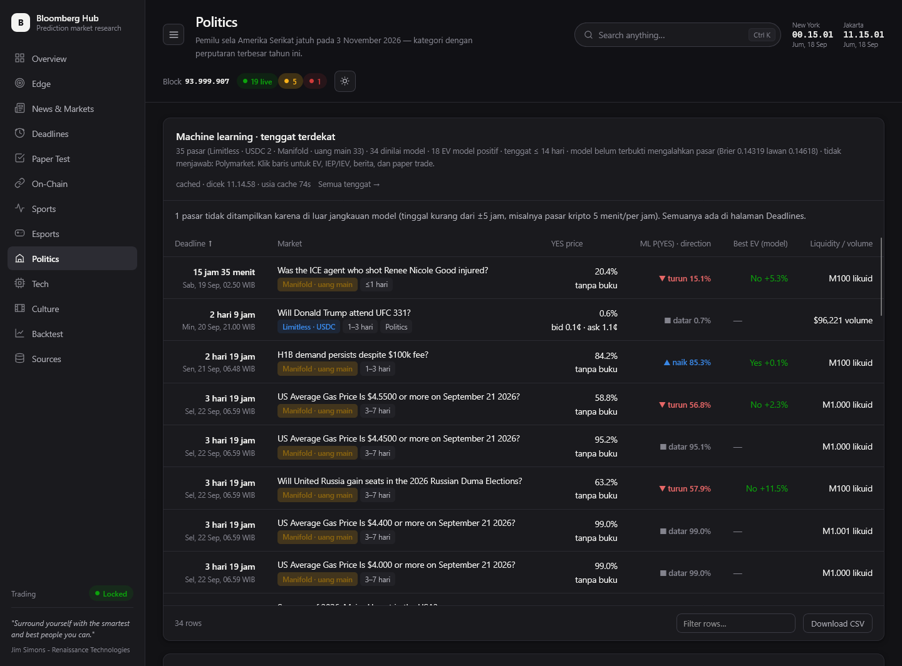
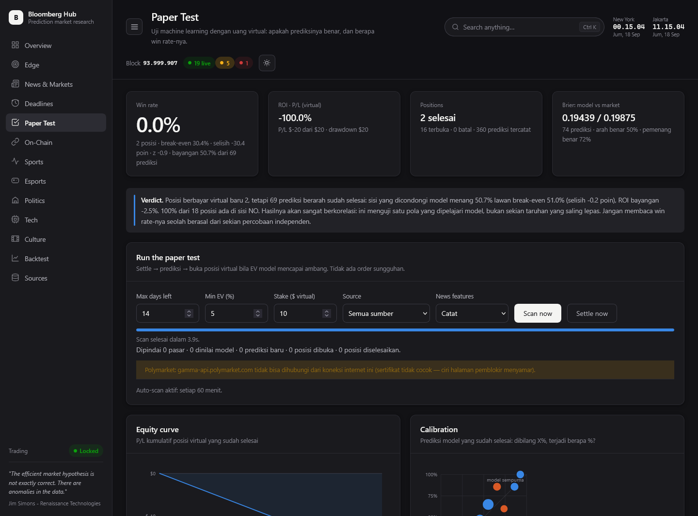
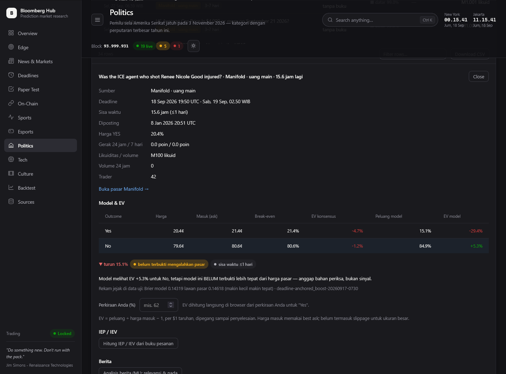
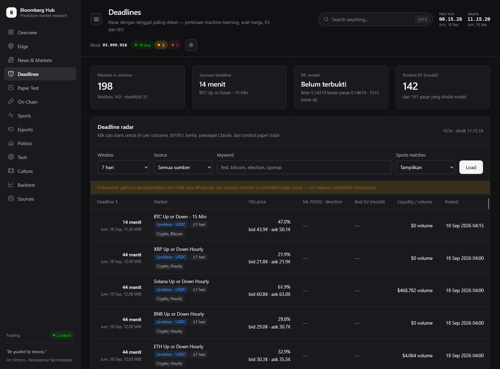
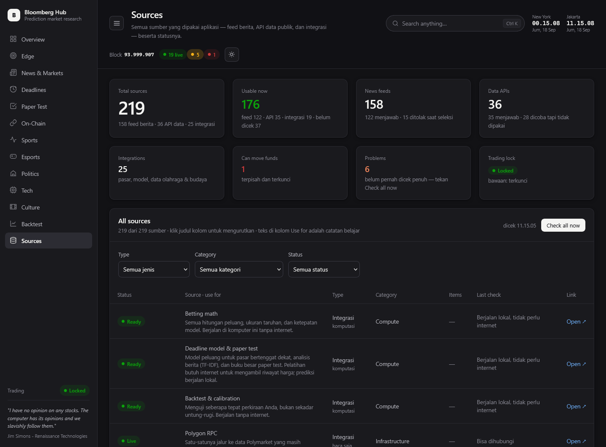
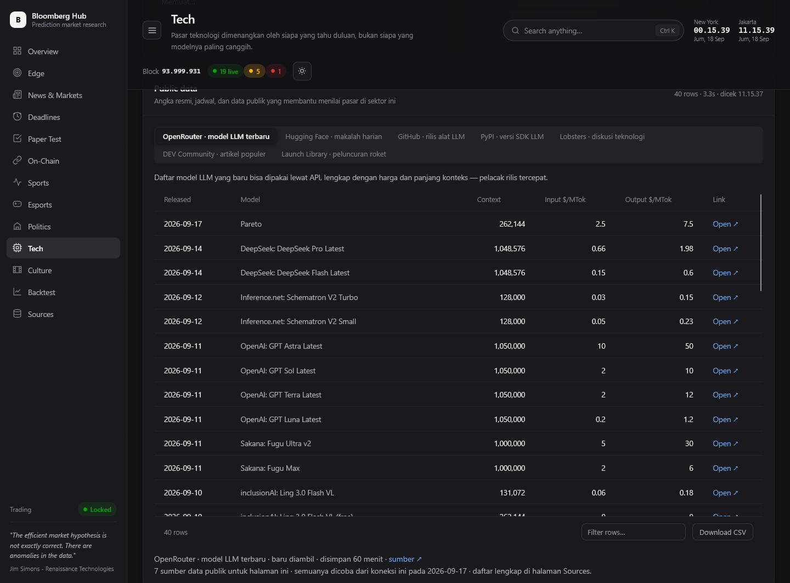
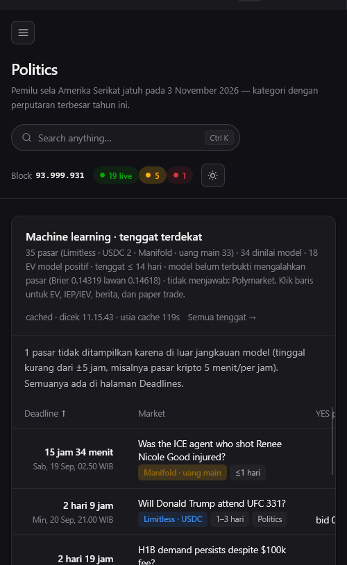

# Bloomberg Hub

Terminal riset prediction market. Sumber datanya dipilih dari
[audit 40 repo GitHub](docs/AUDIT_SUMBER_DATA.md) — hanya yang bervonis hijau dan lolos probe
langsung dari koneksi ini yang di-wrap jadi modul.

Premisnya keras dan jujur: **API Polymarket diblokir dari koneksi ini.** Jadi ini mesin riset,
bukan mesin trading — sampai Anda punya akses lewat VPS/VPN. Selama diblokir, pasar di setiap
halaman diambil dari **Limitless** (uang sungguhan, USDC) dan **Manifold** (uang main), dengan EV,
IEP/IEV, dan model machine learning yang sama; sumber setiap pasar selalu ditulis.

**219 sumber** dipakai: 158 feed berita (157 RSS/Atom + Hacker News), 36 API data publik (harga,
kurs, data resmi AS dan Indonesia, jadwal olahraga, gempa, peluncuran roket), dan 25 integrasi.
Semuanya — dengan status dan kegunaannya — ada di halaman **Sources**.

> **Catatan untuk yang membuka lewat GitHub Pages:** halaman ini hanya README. Bloomberg Hub adalah
> aplikasi **Flask** — halamannya dirakit di server, mengambil data langsung dari puluhan API, dan
> menjalankan model machine learning. GitHub Pages hanya menyajikan berkas statis, jadi aplikasinya
> tidak bisa berjalan di sana. Jalankan sendiri dengan `python app.py`, lalu buka `127.0.0.1:5000`.
> Tangkapan layar di bawah ini diambil dari aplikasi yang sedang berjalan.

## Tampilan

**Overview** — status model ML dan paper test, pasar bertenggat ≤ 3 hari beserta peluang model dan EV,
harga kripto/emas/kurs, cerita berita teratas, dan kondisi semua sumber.



**Kartu machine learning di setiap sektor** — pasar sektor itu yang berakhir dalam 14 hari, arah
(naik/turun) menurut model, EV model terbaik, dan sumber tiap pasar (Limitless USDC atau Manifold).



**Paper test** — win rate di samping break-even, ROI, Brier model lawan harga pasar, kalibrasi, dan
kurva ekuitas. Semua prediksi dicatat sebelum hasilnya diketahui, lalu dicocokkan saat pasar selesai.



<details>
<summary>Tangkapan layar lainnya: detail pasar, deadline radar, sumber, data publik, tampilan ponsel</summary>

**Detail satu pasar** — EV per outcome di harga ask, peluang model dan rekam jejaknya, IEP/IEV dari
buku pesanan, analisis berita, dan tombol paper trade.



**Deadline radar** — semua pasar dengan tenggat terdekat dari Polymarket, Limitless, dan Manifold.



**Sources** — 219 sumber dalam satu tabel: feed berita, API data publik, dan integrasi, dengan status
hasil pengecekan dan catatan kegunaannya.



**Public data** — 36 API data publik, tampil di halaman yang memakainya.



**Lebar ponsel** — setiap halaman diuji pada lebar 414 px; tabel menggulir sendiri, halaman tidak.



</details>

## Jalankan

```bash
pip install -r requirements.txt
cp .env.example .env          # opsional — semuanya jalan tanpa key, sebagian dengan
python app.py                 # http://127.0.0.1:5000
```

Kalau port 5000 sudah dipakai (biasanya server lama yang masih hidup), `app.py` menolak jalan dan
menunjukkan perintah untuk menghentikannya. Server lama yang dibiarkan hidup membuat browser terus
melihat kode lama. Berkas CSS/JS dimuat dengan versi (`?v=<waktu ubah>`), jadi perubahan kode
langsung terlihat tanpa membersihkan cache browser.

Cek apa yang hidup dari koneksi Anda sendiri:

```bash
python run.py health     # kondisi tiap sumber data
python run.py setup      # apa yang masih perlu dilengkapi, dan langkahnya
```

Panduan lengkap untuk mengambil kunci API dan mengunduh data:
[`docs/SETUP.md`](docs/SETUP.md).

## Apa yang bisa dikerjakan hari ini

| Halaman | Alamat | Isi | Perlu internet? |
|---------|--------|-----|-----------------|
| **Overview** | `/` | Status model ML dan paper test, pasar bertenggat ≤ 3 hari dengan peluang model dan EV, harga kripto/emas/kurs, cerita teratas (News ML), data publik, kondisi integrasi | ya |
| **Edge** | `/edge` | Bandingkan perkiraan Anda dengan harga pasar: EV, ukuran taruhan, de-vig, arbitrase, model Poisson | **tidak** |
| **News & Markets** | `/news` | Kabar dari 157 feed teruji di 16 kategori + Hacker News, ringkasan cerita dan kata yang sedang naik (News ML), katalog sumber untuk belajar, buku pesanan dengan IEP/IEV | ya |
| **Deadlines** | `/deadlines` | Pasar dengan tenggat terdekat: hitung mundur, peluang machine learning, arah (naik/turun), EV per outcome, IEP/IEV, analisis berita, pendapat Claude, tombol paper trade | ya |
| **Paper Test** | `/paper` | Uji model dengan uang virtual: win rate lawan break-even, ROI, Brier model lawan pasar, kalibrasi, hasil per sisa waktu, pelatihan dan laporan model | sebagian |
| **On-Chain** | `/on-chain` | Saldo dompet, riwayat posisi, aliran USDC, dan aktivitas pasar lengkap dengan nama pasar dan nilai USDC-nya | Polygon |
| **Sports** | `/sports` | Expected goals, jadwal, odds 1X2 Polymarket, NBA, NFL, StatsBomb | ya |
| **Esports** | `/esports` | Jadwal Dota/CS2/LoL/Valorant dengan odds Polymarket dan indikasi form per pertandingan | ya, tanpa kunci |
| **Politics** | `/politics` | Kartu ML sektor, volume dan nada pemberitaan dunia, data prakiraan pemilu, analisis pasar, data resmi (utang AS, CPI, Bank Dunia, dokumen presiden AS) | ya |
| **Tech** | `/tech` | Kartu ML sektor, rilis LLM terbaru dari blog lab, OpenRouter, GitHub, PyPI, makalah Hugging Face, daftar model Claude | ya |
| **Culture** | `/culture` | Kartu ML sektor, musik dan film dari API resmi, tangga lagu Apple, Wikipedia paling dibaca | ya, sebagian perlu kunci |
| **Backtest** | `/backtest` | Ukur ketepatan perkiraan, kurva ekuitas | **tidak** |
| **Sources** | `/sources` | Semua 219 sumber dalam satu tabel (filter jenis/kategori/status), tombol cek semua, risiko integrasi | sebagian |

**Bahasa antarmuka:** label, judul, tombol, dan nama kolom memakai istilah Inggris yang lazim di
pasar prediksi (bid/ask, spread, edge, order book). Kalimat penjelas — termasuk isi pengungkap
"kenapa begini" dan pesan kegagalan — tetap berbahasa Indonesia.

Dua halaman bertanda **tidak** berjalan sepenuhnya di komputer Anda — tetap bisa dipakai
walaupun semua sumber internet sedang mati.

Tampilannya terang secara bawaan, dengan mode gelap lewat tombol di kanan atas. Menu samping bisa
dilipat jadi ikon. Header memuat jam New York dan Jakarta secara langsung.

Tekan **Ctrl+K** (atau `/`) untuk membuka pencarian. Satu kotak itu mencari empat hal sekaligus:
halaman, isi halaman yang sedang dibuka, berita langsung, dan pasar prediksi. Alamat
`?cari=kata` membuka hasilnya langsung, jadi bisa dibagikan sebagai tautan.

Kabar yang diambil disimpan ke `data/news/` sebagai berkas `.txt` yang bisa dibuka dengan Notepad,
supaya tetap terbaca ketika sumbernya sedang mati.

**EV di semua sektor.** Setiap pasar di panel Politics, Tech, Culture, Sports, Esports, dan News
membawa tabel EV per outcome di harga ask — EV di harga konsensus (selalu ≤ 0: biaya masuk) dan EV
menurut model machine learning bila pasarnya bertenggat ≤ 14 hari — plus tombol IEP/IEV dari buku
pesanan. Ringkasan kategori menampilkan EV model tertinggi.

**Machine learning dan paper test.** Model dilatih dari ribuan pasar yang sudah selesai, dinilai
pada pasar yang tidak pernah dilihatnya **melawan harga pasar itu sendiri**, lalu diuji maju lewat
paper test. Setiap halaman sektor dibuka dengan kartu **Machine learning · tenggat terdekat**: pasar
sektor itu yang berakhir dalam 14 hari, peluang model, arah, dan EV; klik satu baris untuk EV per
outcome, IEP/IEV, berita, pendapat Claude, dan tombol paper trade. Selama `python app.py` berjalan,
paper test mencocokkan hasil dan memindai pasar baru **tiap 60 menit** (uang virtual;
`BH_PAPER_AUTOSCAN_MIN=0` untuk mematikan). Rinciannya, termasuk hasil pengukuran yang jujur:
[`docs/ML_PAPER_TEST.md`](docs/ML_PAPER_TEST.md).

## CLI

```bash
python run.py health                      # probe semua sumber
python run.py sources                     # katalog risiko
python run.py polygon --exchange          # apakah exchange masih mengisi order?
python run.py polygon --wallet 0x… --deep # saldo + riwayat
python run.py edge --prob 62 --price 55   # EV, Kelly, ukuran taruhan
python run.py devig -o "-150,+130"        # buang margin bandar
python run.py esports --schedule counterstrike
python run.py tech --watch                # rilis dari lab yang dipantau
python run.py ml --train --markets 600    # latih model deadline dari pasar yang sudah selesai
python run.py deadlines --days 3          # pasar bertenggat dekat + prediksi + EV
python run.py paper --scan                # settle → prediksi → posisi virtual
python run.py paper --stats               # win rate, ROI, Brier model lawan pasar
python run.py news --catalog              # 157 feed teruji beserta kegunaannya
python run.py deadlines --source limitless # pasar uang sungguhan (USDC) yang terbuka dari sini
```

## Gate uang

Tertutup secara default. `src/polymarket/client.py` adalah **satu-satunya** modul yang menyentuh
kunci; `src/core/registry.py` mencatat sumber mana yang bisa menggerakkan uang, dan
`assert_readonly()` menolak melayaninya lewat jalur baca. Membukanya butuh
`BH_ENABLE_TRADING=1` — dan tetap tidak akan berfungsi dari koneksi yang memblokir Polymarket.

## Dokumen

- [`docs/AUDIT_SUMBER_DATA.md`](docs/AUDIT_SUMBER_DATA.md) — audit 40 repo, daftar hijau dan
  merah, hasil probe lokal
- [`docs/IMPLEMENTASI.md`](docs/IMPLEMENTASI.md) — 12 bug yang diperbaiki, temuan on-chain,
  keputusan desain
- [`docs/ML_PAPER_TEST.md`](docs/ML_PAPER_TEST.md) — EV, IEP/IEV, model deadline, paper test,
  sumber berita, LLM, dan hasil pengukurannya
- [`CLAUDE.md`](CLAUDE.md) — aturan proyek yang dimuat otomatis oleh Claude Code (CLI dan VS Code)
